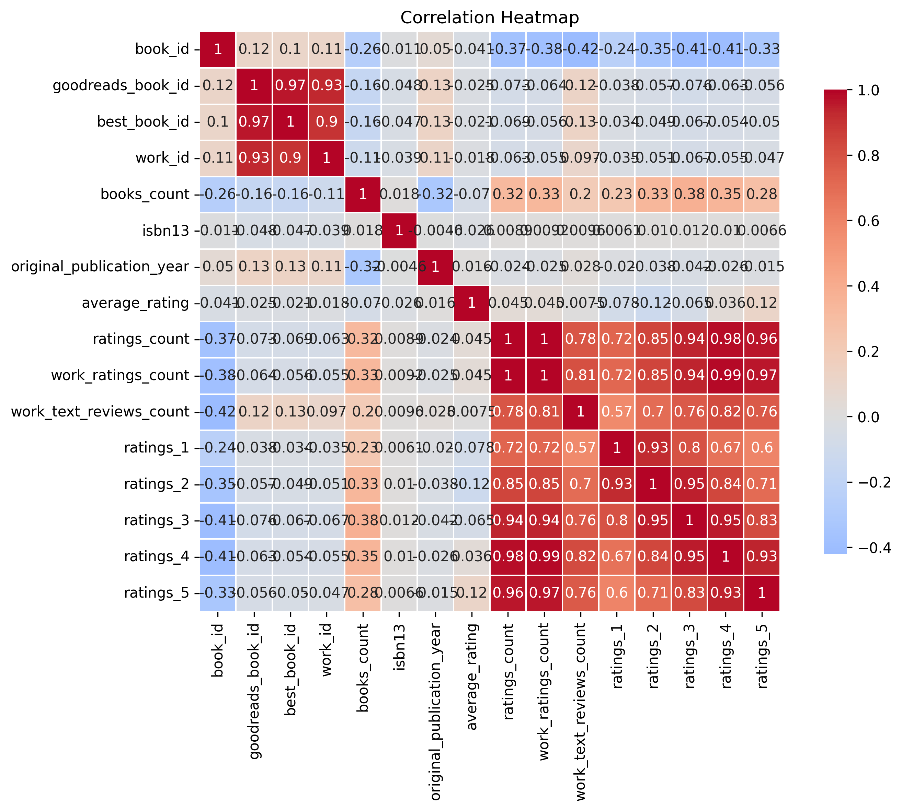

# Analyzing the Literary Landscape: Insights from a Comprehensive Book Dataset

## 1. Brief Data Description

In our quest to unravel the complexities behind readers' preferences and literary successes, we examined a dataset encompassing **10,000 entries** across **23 columns**. This rich dataset explores various attributes of books, including identifiers like `book_id` and `goodreads_book_id`, as well as descriptive features such as `authors`, `title`, `average_rating`, and detailed rating breakdowns from one to five stars. Each entry uses diverse data types to ensure a comprehensive portrayal of each book's footprint in the literary world.

However, it's essential to note the presence of some missing values: we have **700 missing ISBNs**, **585 missing original titles**, and **1084 missing language codes**, which may impact specific analyses. 

## 2. Key Insights from the Analysis

- **Average Ratings and Popularity**: The dataset reveals a healthy average book rating of **4.00**, accompanied by a relatively low standard deviation of **0.25**. This consistency indicates that most books are generally well-received, which is a promising facet for authors and publishers alike.

- **Rating Distribution**: A closer examination of the ratings breakdown shows that books tend to receive the highest number of **5-star ratings**, averaging around **23,790** votes. In contrast, **1-star ratings** are significantly fewer, averaging approximately **1,345**. This overwhelmingly positive response reveals a positive acceptance threshold for newly published works.

- **Publication Year Trends**: The data also illustrates that the majority of the entries are relatively new, with an average original publication year of **1981**, and a majority falling between **2004 and 2017**. This suggests a recent surge in publication activity and reader engagement.

- **Correlation Insights**: A notable correlation exists between the **ratings_count** and **work_ratings_count**, indicating a strong relationship between the quantity of ratings and the credibility of a book. Interestingly, the correlation between **books_count** and **ratings_5** (high star ratings) showcases a positive relationship, suggesting that books with more ratings are likely better received.

- **Language Diversity**: The dataset shows a significant gap in language representation, with **1084 missing entries** in the language code. A holistic approach to including more languages may broaden the reach of readership and diversify literary landscapes.

## 3. Potential Implications or Recommendations

- **Publishing Strategy**: Given the positive reception of books in the dataset, authors and publishers should aim to engage actively with their audience and encourage reviews, which could enhance visibility and reception. Incorporating strategic marketing campaigns for newly published titles could capitalize on existing audience positive sentiment.

- **Data Completeness**: It is crucial for stakeholders to address missing data issues, particularly concerning ISBNs and original titles. Improving data integrity will drive more accurate analyses, helping publishers, authors, and researchers make informed decisions regarding market trends and reader preferences.

- **Diversity in Language Offerings**: To drive inclusiveness, publishers should explore expanding their offerings in multiple languages, catering to an international audience. This presents an opportunity to tap into diverse markets that remain underrepresented.

- **Focus on Top Genres**: Using the existing data, a deeper analysis to determine which genres yield higher ratings could inform future content development strategies. Publishers may want to consider investing more resources in genres or themes that resonate strongly with readers. 

In summary, this extensive dataset provides a captivating glimpse into the literary landscape, revealing trends and dynamics that can empower stakeholders across the book industry�from authors and publishers to avid readers and researchers. The narrative of this data analysis is not merely one of numbers, but a reflection of the vibrant stories, voices, and ideas that continue to shape our reading culture.