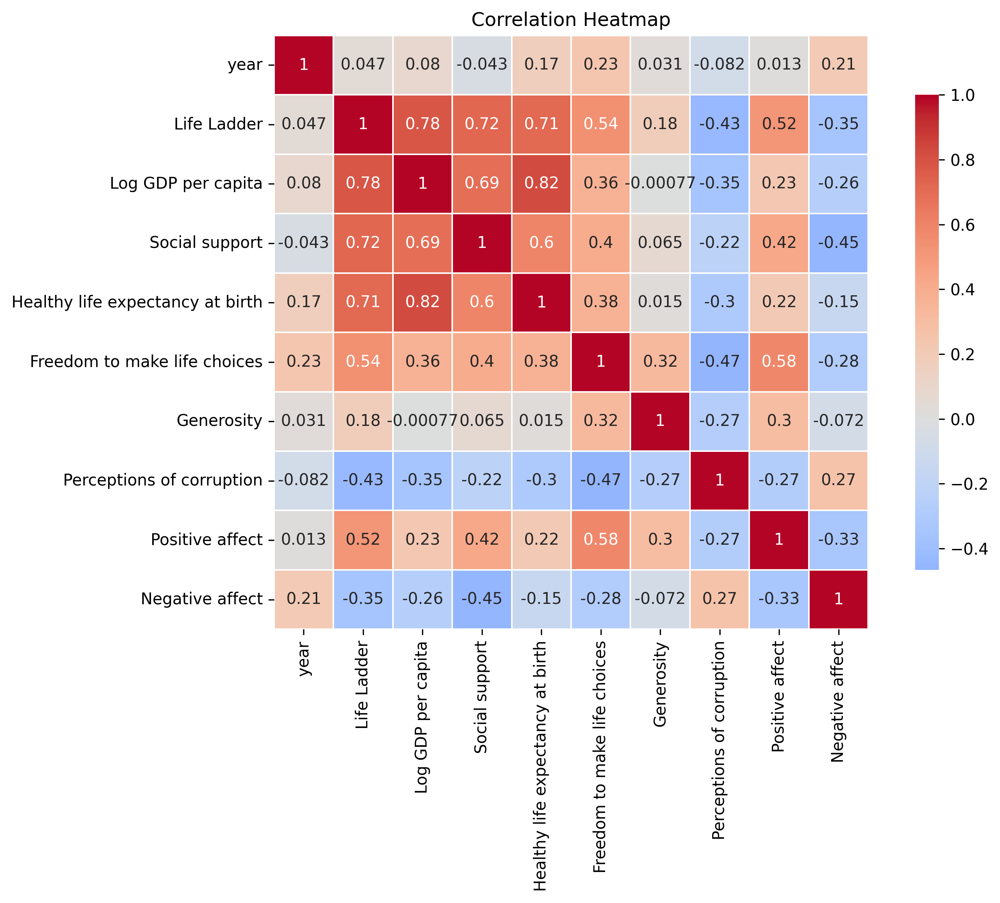

# Exploring the Dimensions of Well-Being: A Comprehensive Analysis of Global Happiness Indicators

In an increasingly interconnected world, understanding the dynamics of well-being and happiness is more crucial than ever. The dataset under review encompasses a fascinating collection of 2,363 rows and 11 columns, reflecting a diversity of countries and their respective indicators of well-being over time. This data unveils critical insights into how various factors converge to shape the happiness and quality of life across different nations.

## Key Insights from the Analysis

1. **Life Ladder and Economic Performance**  
   The _Life Ladder_, a renowned scale for measuring subjective well-being, averages at **5.48**, suggesting a moderate level of happiness globally. Notably, it exhibits a **strong positive correlation (r = 0.78)** with _Log GDP per capita_, indicating that wealthier nations tend to enjoy higher subjective well-being. The stark contrast in the minimum and maximum entries (1.28 to 8.02) reveals profound disparities in happiness levels across countries.

2. **Social Support Matters**  
   Social support emerges as an essential pillar of happiness, with an average score of **0.81**. It correlates positively with the Life Ladder score (r = 0.72), highlighting the significance of community and social networks in fostering well-being. The minimum value of **0.23** suggests that in some regions, lack of support exacerbates feelings of isolation and discontent.

3. **Health and Life Expectancy**  
   The analysis shows that _Healthy life expectancy at birth_ averages **63.40 years** but exhibits substantial variation across countries. A positive correlation (r = 0.72) with _Life Ladder_ underscores the direct link between health and happiness, reinforcing the idea that longevity and quality of health significantly impact subjective well-being.

4. **Perceptions of Corruption and Happiness**  
   Interestingly, perceptions of corruption reveal a discouraging trend, with an average score of **0.74**. This measure negatively correlates with the Life Ladder (r = -0.43), suggesting that higher perceived corruption undermines citizens' happiness and trust in governance. Countries striving for transparency and integrity may see a substantial boost in general well-being.

5. **Emotions Drive Perception**  
   Positive affect averages **0.65**, while negative affect is reported at **0.27**. A notable negative correlation (r = -0.35) between these two underscores how prevailing emotions significantly shape individuals' assessments of their lives.

## Visualization of Happiness Indicators

*Figure 1: Comprehensive visualization of key happiness indicators across different countries, showcasing the interplay between economic, social, and emotional factors.*

## Potential Implications or Recommendations

- **Targeted Policy Interventions**: Governments aiming to enhance citizen happiness should prioritize policies that bolster economic growth while ensuring equitable wealth distribution. Investing in social programs to enhance social support networks can further contribute to elevating happiness levels.

- **Health Initiatives**: Public health campaigns that improve healthcare access and promote healthy living can effectively increase healthy life expectancy and, by extension, overall happiness. 

- **Combatting Corruption**: Striving for transparency and integrity in governance can reduce corruption perceptions, likely enhancing the general well-being of citizens. This aspect emphasizes the importance of establishing robust institutions that citizens can trust.

- **Mental Health Focus**: Given the emotional factors influencing perceived well-being, mental health programs that encourage positive outlooks and emotional resilience may directly impact happiness levels in communities.

By leveraging these insights and recommendations, we can aspire to a world where well-being and happiness are not just distant aspirations but attainable goals for individuals across the globe. Through thoughtful dialogue and strategic policy-making, we can foster environments that nurture not only economic prosperity but also emotional and social fulfillment.