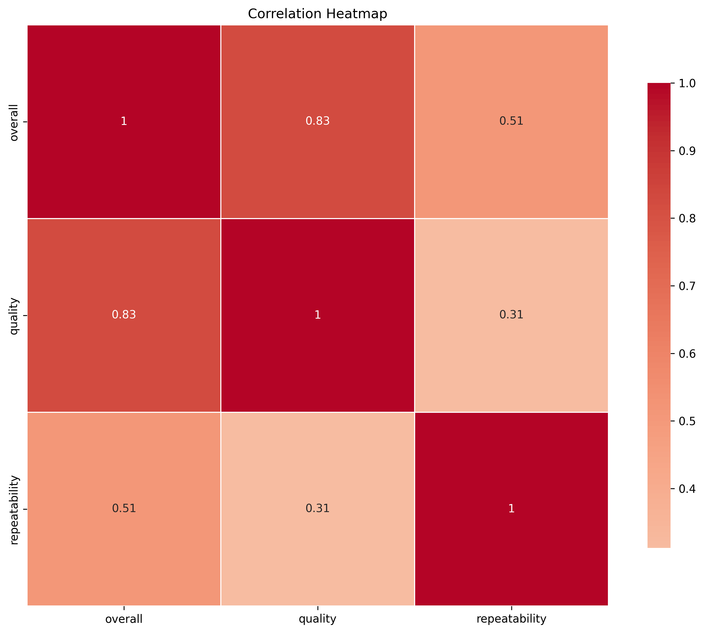

# Unveiling Patterns: A Deep Dive into the Dataset

### 1. Brief Data Description
In our exploration of a dataset comprising 2,652 rows and 8 columns, we delve into a multitude of qualitative variables linked with various assessments. Key columns include **date**, **language**, **type**, **title**, **by**, along with quantitative indicators like **overall**, **quality**, and **repeatability** scores. The dataset, rich with numeric and semantic nuances, serves as an illuminating canvas to discern trends and measures related to performance evaluations.

**Noteworthy observations** reveal some missing values, particularly in the **date** (99 instances) and the **by** column (262 instances), hinting at potential gaps in data collection that might require further investigation.

### 2. Key Insights from the Analysis
#### A. Descriptive Analytics
The descriptive statistics unveil a fascinating picture:
- **Overall Ratings**: The overall score predominantly hovers around 3.05 with a minimal standard deviation of 0.76, indicating a central tendency towards satisfactory evaluations. Despite a range from 1 to 5, it appears that most entries cluster towards the middle of the scale. 
- **Quality Scores**: Slightly higher than the overall mean, quality ratings average around 3.21, showing a marginal preference towards better-quality assessments, yet still emphasizing a similar distribution.
- **Repeatability Metrics**: Unlike overall and quality ratings, repeatability scores paint a different story, averaging at approximately 1.49, predominantly scoring 1 (indicating poor repeatability), with only 25% climbing to a score of 2. This suggests potential reliability concerns within the evaluations presented.

#### B. Correlation Analysis
The correlation matrix reveals compelling relationships among the assessments:
- A robust correlation (0.83) between **overall** and **quality** underscores the intertwined nature of these variables�higher quality assessments more consistently garner better overall ratings.
- The moderate correlation (0.51) between **overall** and **repeatability** suggests that while repeatability does play a role in overall assessments, it is not the primary driver, urging further inquiry into what affects the perceptions of quality versus repeatability.

### 3. Potential Implications or Recommendations
Given these insights, key implications arise:
- **Enhance Data Collection**: Addressing the missing values, particularly in the **date** and **by** columns, could bolster the robustness of findings and improve future analyses. This entails establishing systematic data collection strategies to minimize informational gaps.
- **Focus on Quality Improvement**: The strong correlation between overall satisfaction and quality indicates the necessity for organizations to prioritize quality control mechanisms. Initiatives aimed at training evaluators or refining the parameters for quality could enhance both metrics.
- **Invest in Repeatability Strategies**: The low average repeatability indicates a crucial area for improvement. Organizations should explore the variability in assessments, potentially customizing training or guideline clarity to ensure consistent evaluations. This could bolster the reliability of evaluations and contribute positively to overall ratings.

### Conclusion
This dataset analysis not only sheds light on the performance metrics but also urges stakeholders to reassess their approaches to data management and evaluation practices. As we continue to excavate insights, let this analysis spur strategic discussions and interventions that foster a culture of quality and consistency. Whether navigating through trends or diving into recommendations, this rich dataset offers a fertile ground for impactful change in evaluation processes.